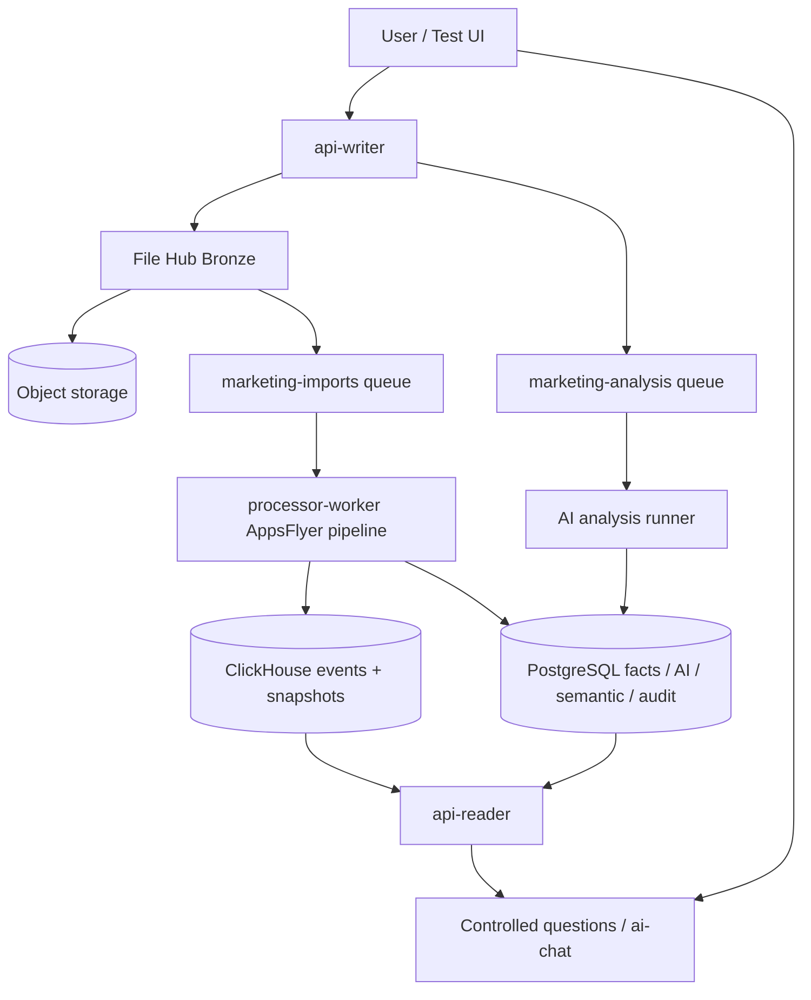

# EventStream Platform — Documentation Index

This repository extends EventStream Platform with the **AI Marketing Copilot** feature layer. Use this index to find the canonical docs for the current implementation.

## Canonical docs

- `README.md` — repository overview, app layout, current API surfaces, and quick start.
- `AGENTS.md` — canonical implementation guide and persistent memory for future AI/code agents.
- `docs_marketing_copilot.md` — detailed current architecture for File Hub, AppsFlyer processing, semantic/context, analysis runs, controlled questions/chat, and test UI.
- `docs/architecture/file-hub-bronze-layer.md` — raw-file upload/profiling/classification/status lifecycle.
- `docs/architecture/appsflyer-medallion-implementation-notes.md` — AppsFlyer stream processing, ClickHouse Silver/Gold, deterministic facts, semantic/context, and AI outputs.
- `docs/analisis-proyecto-conclusiones-recomendaciones.md` — technical assessment, current gaps, risks, and recommended roadmap.
- `marketing_copilot_project_overview.md` — implementation overview by capability and epic.
- `stakeholder_program_overview.md` — stakeholder-friendly summary and delivery status.
- `utils.md` — local commands, migrations, troubleshooting, and manual operational snippets.

## Current production-like flow

## Test UI

- File: `apps/admin/src/assets/atlas-ai-test-ui.html`
- Route: `/api/ui` when `apps/admin` is running.
- Purpose: manually exercise File Hub, import monitoring, analysis runs, AI outputs, controlled questions, and `/ai-chat` compatibility.
