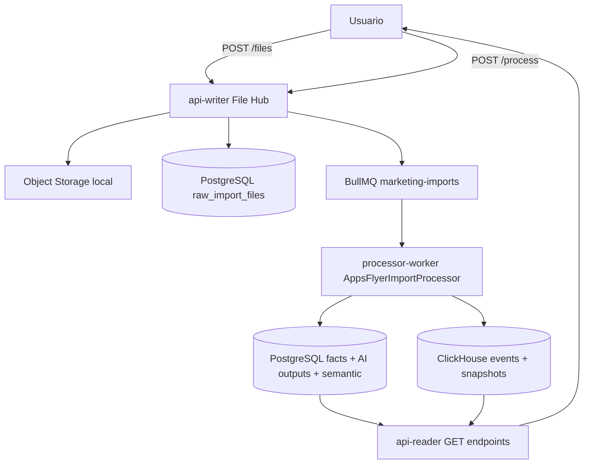
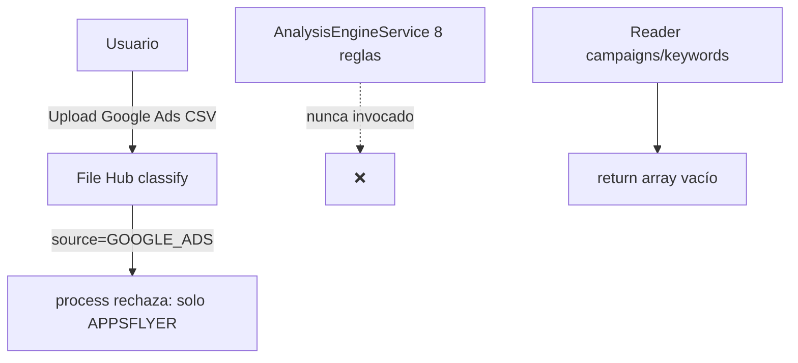

# Análisis del proyecto — EventStream Platform + AI Marketing Copilot

**Fecha:** Junio 2026  
**Alcance:** Monorepo `metrics-platform` (Nx 21, NestJS 10, PostgreSQL, Redis/BullMQ, ClickHouse)  
**Objetivo del documento:** Evaluar el estado real del código, contrastarlo con la visión V1 descrita en `AGENTS.md` y `marketing_copilot_project_overview.md`, y proponer un plan de acción priorizado.

---

## 1. Resumen ejecutivo

El repositorio contiene **dos productos conviviendo en la misma base técnica**:

1. **EventStream Platform (core):** ingesta de eventos, métricas DAU, CQRS, PostgreSQL + Redis + BullMQ.
2. **AI Marketing Copilot (capa marketing):** File Hub, pipeline AppsFlyer, facts determinísticos, outputs de IA, APIs de lectura.

**Conclusión principal:** el proyecto **no es un scaffold vacío**. El flujo **File Hub → cola → worker AppsFlyer → PostgreSQL + ClickHouse → facts → recomendaciones/informes → api-reader** está implementado de forma funcional y auditable. Sin embargo, existe una **brecha significativa entre la documentación de V1 (Google Ads como milestone)** y lo que realmente corre en producción local: **AppsFlyer es el único pipeline end-to-end cableado**.

| Dimensión | Estado |
|-----------|--------|
| Arquitectura modular (libs + apps) | ✅ Sólida |
| File Hub (Bronze Layer) | ✅ Implementado |
| Pipeline AppsFlyer | ✅ End-to-end |
| Motor de 8 reglas Google Ads | ⚠️ Código existe, no invocado |
| Dashboard campañas/keywords | ❌ Stub (`[]`) |
| Import legacy CSV | ❌ In-memory + payload incompatible |
| AI Chat con intents | ❌ Template sin LLM |
| Migraciones automáticas | ❌ Manuales vía Docker |
| Infra local completa | ⚠️ Solo Postgres + Redis |
| Tests E2E | ❌ Desactualizados |

**Recomendación estratégica:** declarar explícitamente que **V1 operativo = AppsFlyer + File Hub**, y tratar **Google Ads / Meta** como **V1.1** con trabajo de cableado concreto, no como algo ya disponible.

---

## 2. Arquitectura actual

### 2.1 Estructura del monorepo

```
apps/
  api-writer      → escritura (eventos + proyectos + File Hub)
  api-reader      → lectura (métricas core + marketing + semántica + AI)
  processor-worker→ consumidor BullMQ + cron DAU + pipeline AppsFlyer
  admin           → auditoría de procesos (API mínima)

libs/
  core-domain | core-shared | core-application | core-infrastructure
  marketing-shared | marketing-infrastructure | marketing-application | marketing-plugins
```

**Principios respetados (según `AGENTS.md`):**

- Extensión del core EventStream sin reescribirlo.
- Separación raw / normalizado / analítico.
- PostgreSQL para transaccional; ClickHouse para series temporales.
- IA solo sobre facts estructurados (no CSV crudo).
- Procesamiento CSV por streams en el pipeline AppsFlyer.

**Principio parcialmente cumplido:**

- Object storage abstracto existe, pero la implementación es **filesystem local** (`/tmp/marketing-object-storage`), no S3/MinIO real.

### 2.2 Grafo de dependencias (marketing)

```
marketing-shared
       ↑
marketing-infrastructure ← marketing-plugins
       ↑                        ↑
marketing-application ───────────┘
       ↑
   apps (writer / worker / reader)
```

La separación de capas es coherente: contratos en `shared`, persistencia en `infrastructure`, orquestación en `application`, plugins de dominio en `marketing-plugins`.

### 2.3 Patrones técnicos

| Patrón | Uso |
|--------|-----|
| CQRS | Core EventStream (`CreateEventCommand`, queries de métricas) |
| BullMQ | Colas `events` y `marketing-imports` |
| TypeORM | Entidades core (`events`, `metrics`) con `synchronize: true` |
| SQL manual | Schema marketing (10 migraciones PostgreSQL) |
| Plugins | DAU (core), AppsFlyer (parse/normalize/facts), Analysis Engine (Google Ads, no cableado) |
| Medallion | Statuses en `data_imports`: BRONZE → SILVER → GOLD → AI → COMPLETED |

---

## 3. Estado de implementación por componente

### 3.1 `api-writer` (puerto 3001)

**Implementado y persistente:**

- `POST /api/events` — ingesta EventStream.
- `POST/GET /api/projects` — PostgreSQL vía `ProjectRepository`.
- File Hub completo:
  - Upload, listado, detalle, delete, tags.
  - `POST .../process` y `POST .../reprocess` — publica job BullMQ.

**Parcial / problemático:**

- `POST /api/projects/:id/imports/csv` y `GET .../imports` usan un **`Map` en memoria** (`apps/api-writer/src/app/app.service.ts`). Los datos no sobreviven reinicios y no escriben en `data_imports`.
- El job publicado por el import legacy **no incluye el payload File Hub** (`rawFileId`, `source`, `reportType`) que exige `AppsFlyerImportProcessor`.

**Implicación:** el endpoint legacy parece existir por compatibilidad documental, pero **no es un camino válido** para procesar archivos hoy. El camino correcto es File Hub.

### 3.2 `processor-worker`

**Implementado:**

- Cola `events` → orquestador DAU (batch + realtime).
- Cola `marketing-imports` → `AppsFlyerImportProcessor` con pipeline completo:
  - Validación → audit trail → stream parse → normalización → ClickHouse (`marketing_events`, `marketing_metric_snapshots`) → PostgreSQL (`detected_facts`, entidades) → capa semántica → contexto → `AiOutputOrchestratorService`.
- Retry BullMQ: 3 intentos, backoff exponencial.

**No cableado:**

- `AnalysisEngineService` y las 8 reglas V1 (`HIGH_SPEND_ZERO_CONVERSIONS`, etc.) están registradas en `MarketingPluginsModule` pero **nunca se invocan** desde el worker.
- `marketing-import-placeholder.processor.ts` existe pero no está registrado.
- Tabla ClickHouse `marketing_daily_metrics` tiene migración SQL pero **ningún insert en código**.

### 3.3 `api-reader` (puerto 3000)

**Implementado con datos reales (PostgreSQL / ClickHouse):**

- Métricas core EventStream.
- Facts, recommendations, reports — repositorios PostgreSQL.
- AppsFlyer: overview, events, media sources, campaigns, blocked traffic, import summary.
- Capa semántica: entities, relationships, context objects.
- Auditoría de procesos e import flow.

**Stub o incompleto:**

- `GET .../campaigns` y `GET .../keywords` → **`return []`** (Google Ads).
- Dashboard mezcla AppsFlyer real con totales Google Ads en **cero hardcodeado**.
- `POST .../ai-chat` → respuesta template en español con el primer fact; **sin intent classifier, sin LLM, sin funciones controladas** (contradice `AGENTS.md`).

### 3.4 Capa de IA

**Fortalezas:**

- Prompt defensivo (`AI_DEFENSIVE_SYSTEM_PROMPT`).
- Providers: OpenAI, Gemini, Claude + MockAiProvider.
- Factory con fallback a mock en test / sin API keys.
- Generadores de recomendaciones e informes desde facts.
- Orquestador con persistencia PostgreSQL y fallback determinístico si la IA falla.
- Integración en el pipeline AppsFlyer (paso `AI_OUTPUT_GENERATION` auditable).

**Debilidades:**

- Chat no usa la capa de providers.
- `AiExplainerService` exportado pero no conectado al reader.
- Sin métricas de costo/latencia de llamadas IA.
- Sin versionado de prompts en base de datos.

### 3.5 Persistencia y schema

**PostgreSQL (10 migraciones en `apps/processor-worker/src/database/migrations/`):**

| Migración | Contenido |
|-----------|-----------|
| 004 | Tablas core marketing (projects, imports, facts, AI outputs, etc.) |
| 005 | Extensión File Hub (Bronze) |
| 006–007 | Statuses medallion + ampliación VARCHAR |
| 008 | Process audit |
| 009 | Metadata AI en outputs |
| 010 | Capa semántica + contexto |

**Tablas con schema pero sin código TypeORM/repository activo:**

- `integrations`, `exchange_rates`, `project_privacy_settings`, `entity_meta`.

**ClickHouse (2 migraciones):**

| Tabla | Uso en código |
|-------|---------------|
| `marketing_events` | ✅ Inserts AppsFlyer |
| `marketing_metric_snapshots` | ✅ KPIs agregados |
| `marketing_daily_metrics` | ❌ Solo schema |

**Riesgo operativo:** ClickHouse es **opcional**. Si `CLICKHOUSE_URL` no está configurado o `CLICKHOUSE_DISABLED=true`, los inserts son **no-op silencioso**. Esto facilita desarrollo local pero puede ocultar fallos en staging.

### 3.6 Infraestructura y DevOps

**`docker-compose.yml`:** solo Postgres 15 + Redis 7.

**Faltan en compose local:**

- MinIO / S3
- ClickHouse
- Servicios de aplicación

**CI (`.github/workflows/ci.yml`):**

- `npm ci --legacy-peer-deps` + `nx affected -t lint test build`.
- No ejecuta migraciones, no levanta Docker, no corre E2E integrados.

**Problemas de DX recientes (observados en sesiones de desarrollo):**

- Webpack externaliza libs `@metrics-platform/*` → requiere `dist/libs/*` compilado antes de `serve`.
- Builds parciales / cache stale pueden producir errores como módulos faltantes en `dist`.
- Migraciones PostgreSQL aplicadas manualmente (`utils.md`).

---

## 4. Flujos de datos

### 4.1 Flujo operativo (AppsFlyer — funcional)



### 4.2 Flujo documentado pero no operativo (Google Ads V1)



### 4.3 Flujo legacy (roto)

`POST /imports/csv` → storage + cola → worker espera payload File Hub → **falla validación** o no procesa. Listado en memoria → **pérdida de datos al reiniciar**.

---

## 5. Fortalezas del proyecto

1. **Arquitectura extensible bien pensada.** La separación core/marketing permite evolucionar sin reescribir EventStream.
2. **Pipeline AppsFlyer maduro.** Stream parsing, medallion statuses, audit trail, semantic layer y AI orchestration en un solo flujo trazable.
3. **IA defensiva by design.** Facts-first, fallback determinístico, mock provider para tests — alineado con confianza y auditabilidad.
4. **Contratos tipados.** `DetectedFact`, enums, File Hub contracts en `marketing-shared` reducen drift.
5. **Cobertura unitaria razonable en marketing.** ~27 specs en File Hub, AppsFlyer, AI, semántica, ClickHouse factory.
6. **Documentación para agentes.** `AGENTS.md` es una guía de implementación persistente poco común y muy valiosa.
7. **Reader APIs ricas para AppsFlyer.** Overview, campaigns, blocked traffic, semantic bundle — más allá del MVP original.

---

## 6. Brechas críticas

| # | Brecha | Impacto | Evidencia |
|---|--------|---------|-----------|
| 1 | Google Ads no procesable | El milestone V1 de `AGENTS.md` no se cumple | `file-hub.service.ts` L197–199 rechaza fuentes ≠ APPSFLYER |
| 2 | Analysis Engine desconectado | 8 reglas implementadas pero sin efecto | `AnalysisEngineService` solo exportado, no usado en worker |
| 3 | Import legacy engañoso | API expuesta que no funciona E2E | `Map` in-memory + payload incompatible |
| 4 | AI Chat incompleto | Criterio de éxito V1 (#8) no cumplido | Template sin intents ni LLM |
| 5 | Migraciones manuales | Fricción onboarding, errores de constraint | `utils.md` + SQL manual |
| 6 | ClickHouse silencioso | Datos faltantes sin alerta clara | Factory deshabilita inserts sin error visible al usuario |
| 7 | E2E desactualizados | CI no detecta regresiones de integración | Tests esperan `Hello API` y puerto 3000 para writer |
| 8 | `synchronize: true` en core | Riesgo en producción | `database.module.ts` |
| 9 | Storage local | No portable a cloud sin cambio | Filesystem bajo `/tmp` |
| 10 | Tablas huérfanas | Schema inflado sin uso | integrations, FX, privacy |

---

## 7. Deuda técnica

### Alta prioridad

- Eliminar o migrar el import legacy a File Hub / PostgreSQL.
- Cablear `AnalysisEngineService` o documentar su postponement explícito.
- Runner de migraciones (TypeORM migrations, Flyway, o script Nx).
- Desactivar `synchronize: true` en entornos no-dev.

### Media prioridad

- Implementar adapter S3/MinIO real detrás de `ObjectStorageService`.
- Poblar `marketing_daily_metrics` o eliminar la tabla si no se usará en V1.
- Actualizar tests E2E (puertos, endpoints, flujo File Hub).
- Añadir ClickHouse + MinIO opcionales a `docker-compose.yml`.
- Unificar experiencia `serve` (build deps, documentar `rm -rf dist`).

### Baja prioridad

- UI admin (hoy solo API).
- Tablas `integrations`, `exchange_rates`, `project_privacy_settings`.
- Retention metric plugin (comentado en worker).
- Nx Cloud / task distribution en CI.

---

## 8. Riesgos

| Riesgo | Probabilidad | Severidad | Mitigación |
|--------|--------------|-----------|------------|
| Usuario sube Google Ads CSV y espera insights | Alta | Alta | Mensaje claro en API + docs; bloquear classify sin mensaje explícito |
| ClickHouse off → reader vacío | Media | Media | Health check + flag `unavailableMetrics` más visible |
| Migración no aplicada → constraint errors | Alta | Alta | Runner automático + check en startup |
| Dist stale → serve falla | Media | Baja | Script `nx run-many --target=build` pre-serve documentado |
| IA mock en prod por misconfig | Media | Alta | Validación env en bootstrap; rechazar start si `AI_REQUIRED=true` sin keys |
| `synchronize: true` altera schema prod | Baja | Crítica | Desactivar fuera de dev |

---

## 9. Recomendaciones priorizadas

### Fase 0 — Alineación de producto (1–2 días)

1. **Actualizar documentación externa** (`README.md`, overview stakeholder) para reflejar: *V1 operativo = AppsFlyer + File Hub*.
2. **Marcar endpoints legacy como deprecated** en Swagger (`/imports/csv`) con respuesta que redirija a File Hub.
3. **Definir el siguiente milestone:** ¿Google Ads pipeline o profundizar AppsFlyer (UI, chat, FX)?

### Fase 1 — Estabilidad operativa (1–2 semanas)

1. **Migration runner Nx:**
   ```bash
   nx run processor-worker:migrate   # propuesto
   ```
   Ejecutar 004–010 en orden; fallar startup si schema esperado no existe.

2. **Eliminar import in-memory:** migrar `createProjectImport` a `DataImportRepository` + payload File Hub compatible, o eliminar endpoint.

3. **Health endpoints** en writer/reader/worker:
   - PostgreSQL, Redis, ClickHouse (configured/disabled/error), object storage writable.

4. **Fix E2E mínimo:** un test que haga upload File Hub → process → poll status → GET facts.

5. **Docker-compose extendido (perfil `full`):**
   - ClickHouse (o documentar Cloud obligatorio).
   - MinIO para storage real.

6. **Desactivar `synchronize: true`** cuando `NODE_ENV !== 'development'`.

### Fase 2 — Completar V1 Google Ads (2–4 semanas)

1. **Pipeline Google Ads** (nuevo processor o rama en pipeline existente):
   - Stream CSV parser plugin (similar AppsFlyer).
   - Normalización a `marketing_entities` + inserts `marketing_daily_metrics`.
   - Invocar `AnalysisEngineService.execute()` en paso GOLD.

2. **Reader campaigns/keywords:** consultar ClickHouse/PostgreSQL, no arrays vacíos.

3. **Dashboard unificado:** agregar por fuente (`source` query param) en lugar de mezclar ceros.

4. **Facts Google Ads:** persistir output del analysis engine en `detected_facts`.

### Fase 3 — AI Chat V1 real (1–2 semanas)

1. **Intent classifier** (reglas o LLM ligero) con intents de `AGENTS.md`:
   - `PROJECT_SUMMARY`, `CAMPAIGN_PERFORMANCE`, `KEYWORD_PERFORMANCE`, `TOP_PROBLEMS`, `RECOMMENDATIONS`, `GENERATE_REPORT`.

2. **Funciones controladas** que consulten repos existentes (no Text-to-SQL).

3. **LLM final** solo para redactar respuesta desde JSON estructurado + facts.

4. **Conectar `AiExplainerService`** al flujo de chat.

### Fase 4 — Producción (ongoing)

1. Adapter S3/MinIO con credenciales IAM.
2. Observabilidad: traceId ya existe en jobs — añadir logging estructurado + métricas por paso medallion.
3. CI: job con Postgres + Redis service containers; test de integración File Hub.
4. Política de retención y privacy (`project_privacy_settings`).
5. Multi-moneda (`exchange_rates`) si aplica a clientes internacionales.

---

## 10. Roadmap sugerido (visual)

```
Ahora          4 semanas         8 semanas         12 semanas
  │                │                 │                 │
  ├─ Estabilidad   ├─ Google Ads     ├─ AI Chat        ├─ Prod hardening
  │  migraciones   │  pipeline       │  intents        │  S3, observability
  │  health        │  8 reglas       │  LLM controlado │  CI integración
  │  E2E fix       │  reader KPIs    │                 │  privacy/FX
  │  docs honestas │                 │                 │
  └─ AppsFlyer ✅  └─ Milestone V1   └─ Chat V1        └─ V2 integrations
     (operativo)      AGENTS.md         completo          (APIs ads networks)
```

---

## 11. Conclusiones finales

1. **El proyecto está más avanzado de lo que sugiere `README.md` ("scaffold")** en el eje AppsFlyer, pero **menos avanzado de lo que implica `AGENTS.md`** en el eje Google Ads / chat / dashboard unificado.

2. **La arquitectura es la decisión correcta** para escalar a múltiples fuentes (AppsFlyer, Google Ads, Meta) sin reescribir. El File Hub + medallion + audit trail es un activo reutilizable.

3. **El mayor riesgo hoy no es técnico sino de expectativas:** APIs y docs que sugieren capacidades Google Ads que el runtime rechaza o devuelve vacío.

4. **La inversión más rentable a corto plazo** es estabilidad operativa (migraciones, health, E2E, deprecar legacy) antes de añadir nuevas fuentes.

5. **Para demostrar el milestone V1 original** (upload Google Ads → `HIGH_SPEND_ZERO_CONVERSIONS` en dashboard), hace falta **una sola vertical slice**: parser Google Ads → métricas → `AnalysisEngineService` → facts → reader — reutilizando casi todo lo ya construido.

---

## 12. Referencias internas

| Documento | Propósito |
|-----------|-----------|
| `AGENTS.md` | Guía canónica V1 (visión target) |
| `marketing_copilot_project_overview.md` | Resumen stakeholder |
| `docs/architecture/file-hub-bronze-layer.md` | File Hub diseño |
| `docs/architecture/appsflyer-medallion-implementation-notes.md` | Pipeline AppsFlyer |
| `utils.md` | Comandos operativos locales |
| `apps/processor-worker/src/database/migrations/` | Schema PostgreSQL |
| `apps/processor-worker/src/database/migrations/clickhouse/` | Schema ClickHouse |

---

*Documento generado tras revisión del código fuente, configuración Nx/webpack, migraciones SQL, flujos de cola y estado de tests. Para actualizaciones, contrastar siempre con `git main` y el estado de las migraciones aplicadas en el entorno local.*
