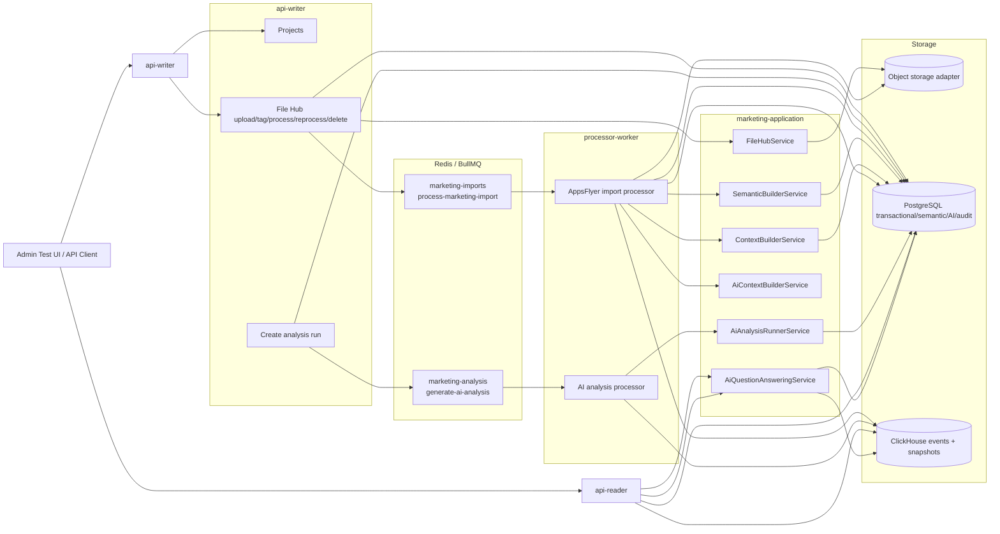
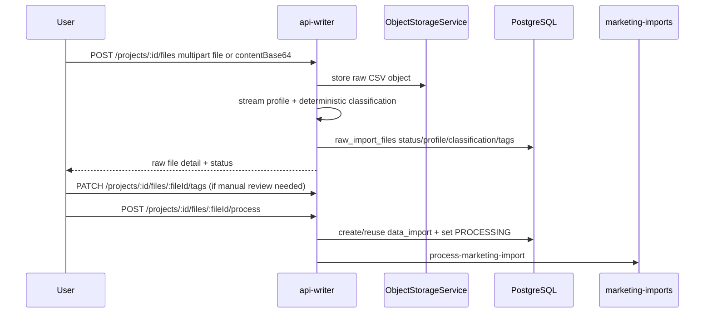
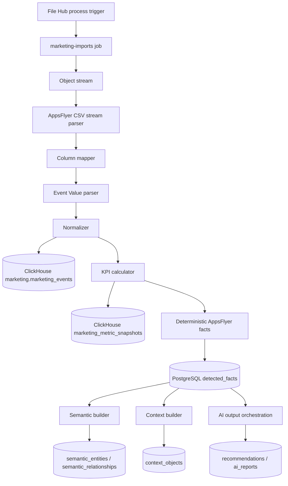
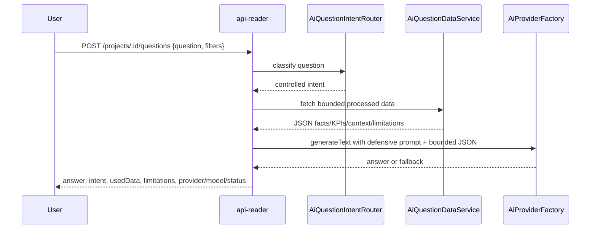

# AI Marketing Copilot — Documento técnico de arquitectura y estado actual

> Estado actualizado del repositorio: EventStream Platform extendido con File Hub, pipeline AppsFlyer medallion, capa semántica/contextual, análisis AI explícito, preguntas controladas/chat con IA y UI HTML de pruebas.

---

## 1. Objetivo del sistema

El objetivo es extender EventStream Platform con un **AI Marketing Copilot** que permita:

1. crear proyectos de marketing,
2. subir CSVs al File Hub,
3. almacenar el raw file separado de los datos normalizados,
4. perfilar y clasificar archivos antes del procesamiento,
5. procesar archivos por cola de forma stream-based,
6. persistir eventos/metric snapshots en ClickHouse,
7. persistir hechos, auditoría, contexto semántico y salidas AI en PostgreSQL,
8. generar recomendaciones/reportes facts-first,
9. responder preguntas controladas con IA sobre datos procesados,
10. probar el flujo completo desde un HTML sin framework.

El core EventStream se conserva: `api-writer`, `api-reader`, `processor-worker`, PostgreSQL, Redis/BullMQ y arquitectura modular Nx.

---

## 2. Estado funcional por capa

### 2.1 Core y apps

| App | Estado actual |
| --- | --- |
| `apps/api-writer` | Expone eventos core, proyectos, File Hub, legacy imports y creación de analysis runs. Publica jobs en `marketing-imports` y `marketing-analysis`. |
| `apps/api-reader` | Expone métricas core, dashboard/overview, AppsFlyer reader views, facts, recommendations, reports, semantic/context, process audit, analysis runs, questions y `ai-chat` alias. |
| `apps/processor-worker` | Consume imports AppsFlyer y analysis runs AI. Incluye migraciones PostgreSQL y ClickHouse. |
| `apps/admin` | Sirve una UI HTML/JS de pruebas en `/api/ui` y endpoints admin auxiliares de procesos. |

### 2.2 Librerías marketing

| Librería | Responsabilidad |
| --- | --- |
| `marketing-shared` | Contratos compartidos: facts, File Hub, AppsFlyer, semantic/context, process audit, analysis runs y jobs. |
| `marketing-plugins` | Plugins AppsFlyer, parser stream, mapper, normalizer, KPI calculator, deterministic facts y analysis engine de reglas V1. |
| `marketing-application` | Orquestación File Hub, AI providers, recommendations/reports, AI context builder, semantic/context builders, analysis-run runner y controlled questions. |
| `marketing-infrastructure` | Object storage, PostgreSQL repositories, ClickHouse repositories, process audit, semantic/context repositories y AI output repositories. |

---

## 3. Arquitectura actual

---

## 4. Flujo File Hub / Bronze Layer

El File Hub es el punto canónico para nuevos uploads de marketing CSV.

Current lifecycle:

`UPLOADED → PROFILING → PROFILED → READY_TO_PROCESS | NEEDS_REVIEW → PROCESSING → COMPLETED | FAILED`

Important guardrails:

- Unknown or low-confidence files must go to `NEEDS_REVIEW`.
- Only `READY_TO_PROCESS` files should be queued for processing.
- The current processing path is AppsFlyer-only. Non-AppsFlyer sources are accepted as metadata/filters for future extensibility but should not be silently processed as if supported.

---

## 5. AppsFlyer Medallion pipeline

Supported AppsFlyer reports include installs, in-app events, non-organic in-app events, postbacks, conversions, blocked reports, ad revenue and uninstalls.

Operational notes:

- Processing reads from object storage streams; do not write full temporary CSVs to container disk for large exports.
- Event Value parsing is defensive. Malformed values should become row warnings, not fatal import errors.
- AppsFlyer is not a trusted cost source for V1. ROAS/CPA/CAC facts must not be generated from AppsFlyer alone.
- Worker failure handling records status, summary and stage on `data_imports`, `raw_import_files` and process-audit tables.

---

## 6. Semantic & Context Layer

The semantic/context layer stores AI grounding data in PostgreSQL while metrics/time series remain in ClickHouse.

Implemented objects:

- `semantic_entities`: canonical source-aware entities, aliases and metadata.
- `semantic_relationships`: source-aware relationships between semantic entities.
- `context_objects`: bounded AI grounding content generated from processed facts/KPIs.
- `detected_facts.semantic_entity_id`, `related_semantic_entity_ids`, `context_object_ids`: fact enrichment links.

Important behavior:

- `SemanticBuilderService` and the AppsFlyer semantic adapter upsert entities/relationships from facts and KPI summaries.
- `ContextBuilderService` writes bounded context objects for later AI grounding.
- `AiContextBuilderService` filters facts by controlled dimensions, redacts raw/CSV fields, bounds payload size and records unavailable metrics/warnings.
- Enrichment is optional unless `SEMANTIC_CONTEXT_STRICT=true`.

---

## 7. AI providers, outputs and explicit analysis runs

### 7.1 Provider model

The AI provider layer supports:

- `mock` provider for deterministic/local behavior,
- OpenAI provider,
- Claude provider,
- Gemini provider.

Feature code should use the provider factory/orchestrator rather than instantiating providers directly.

### 7.2 AI output rules

AI outputs must be generated from:

- detected facts,
- processed KPI summaries,
- semantic entities/relationships,
- context objects,
- explicit warnings/unavailable metrics.

AI outputs must not be generated directly from raw CSV.

### 7.3 Explicit analysis runs

Manual analysis runs separate AI generation from import processing.

Writer endpoint:

- `POST /projects/:id/analysis-runs`

Queue:

- queue: `marketing-analysis`
- job: `generate-ai-analysis`
- attempts: `3`
- backoff: exponential `2000ms`

Processor:

- `AiAnalysisProcessor` consumes `marketing-analysis`.
- `AiAnalysisRunnerService` loads bounded processed context and writes recommendations/reports linked to `analysis_run_id`.

Lifecycle:

`QUEUED → RUNNING → COMPLETED | COMPLETED_WITH_WARNINGS | FAILED | SKIPPED`

---

## 8. Controlled questions and chat with IA

The reader exposes controlled questions as the preferred chat path:

- `POST /projects/:id/questions`
- `POST /projects/:id/ai-chat` as compatibility alias

Current intent router supports:

- `PROJECT_SUMMARY`
- `IMPORT_SUMMARY`
- `TOP_FACTS`
- `EVENT_PERFORMANCE`
- `MEDIA_SOURCE_PERFORMANCE`
- `CAMPAIGN_PERFORMANCE`
- `BLOCKED_TRAFFIC`
- `RECOMMENDATIONS`
- `REPORT_SUMMARY`
- `DATA_QUALITY`
- `UNAVAILABLE_METRICS`
- `SEMANTIC_CONTEXT`
- `UNKNOWN`

Flow:

Guardrails:

- No open Text-to-SQL.
- No raw CSV access.
- Cost-based metrics are marked unavailable without a trusted cost source.
- If AI provider fails and `AI_REQUIRED` is not true, deterministic fallback answers are returned.

---

## 9. API surface summary

### Writer

| Method | Path | Purpose |
| --- | --- | --- |
| `POST` | `/events` | Core event ingestion. |
| `POST` | `/projects` | Create project. |
| `GET` | `/projects` | List projects. |
| `POST` | `/projects/:id/imports/csv` | Legacy CSV import compatibility. |
| `GET` | `/projects/:id/imports` | Legacy import list. |
| `POST` | `/projects/:id/files` | Upload raw file into File Hub. |
| `GET` | `/projects/:id/files` | List File Hub files. |
| `GET` | `/projects/:id/files/:fileId` | File detail. |
| `PATCH` | `/projects/:id/files/:fileId/tags` | Manual source/report tagging. |
| `POST` | `/projects/:id/files/:fileId/process` | Queue processing. |
| `POST` | `/projects/:id/files/:fileId/reprocess` | Reset and queue again. |
| `DELETE` | `/projects/:id/files/:fileId` | Delete metadata + stored object. |
| `POST` | `/projects/:id/analysis-runs` | Create manual AI analysis run. |

### Reader

| Method | Path | Purpose |
| --- | --- | --- |
| `GET` | `/metrics`, `/metrics/:metricName` | Core metrics compatibility. |
| `GET` | `/projects/:id/dashboard` | Project dashboard summary. |
| `GET` | `/projects/:id/overview` | Project overview. |
| `GET` | `/projects/:id/metrics` | Project metrics. |
| `GET` | `/projects/:id/entities/performance` | Entity performance. |
| `GET` | `/projects/:id/events/by-name` | Events grouped by name. |
| `GET` | `/projects/:id/appsflyer/*` | AppsFlyer-specific reader views. |
| `GET` | `/projects/:id/facts` | Detected facts. |
| `GET` | `/projects/:id/recommendations` | Recommendations. |
| `GET` | `/projects/:id/reports` | AI reports. |
| `GET` | `/projects/:id/semantic/entities` | Semantic entities. |
| `GET` | `/projects/:id/semantic/relationships` | Semantic relationships. |
| `GET` | `/projects/:id/context` | Context objects. |
| `GET` | `/projects/:id/analysis-runs` | Analysis run list. |
| `GET` | `/projects/:id/analysis-runs/:analysisRunId` | Analysis run detail. |
| `GET` | `/projects/:id/processes` | Process audit runs. |
| `GET` | `/projects/:id/processes/:runId` | Process audit detail. |
| `GET` | `/projects/:id/imports/:importId/flow` | Import flow detail. |
| `POST` | `/projects/:id/questions` | Controlled AI question. |
| `POST` | `/projects/:id/ai-chat` | Chat compatibility alias. |

---

## 10. HTML test UI

Source:

- `apps/admin/src/assets/atlas-ai-test-ui.html`

Served route:

- `GET /api/ui` from `apps/admin`.

Default port convention:

- `api-reader`: `3000`
- `api-writer`: `3001`
- `admin`: `3002`

The UI includes tabs for:

- endpoint/project configuration stored in localStorage,
- project creation/listing,
- File Hub upload/list/detail/tag/process/reprocess/delete,
- monitoring jobs/import flow/process runs/analysis runs,
- AI outputs,
- controlled questions and `/ai-chat` alias.

---

## 11. Persistence overview

### PostgreSQL

Implemented table families:

- core marketing/project/import tables,
- File Hub metadata and lifecycle columns,
- detected facts,
- recommendations and AI reports with provider/model/prompt metadata,
- process audit runs and steps,
- semantic entities and relationships,
- context objects,
- explicit analysis runs.

### ClickHouse

Implemented/defined tables:

- `marketing.marketing_events` — AppsFlyer Silver normalized events.
- `marketing.marketing_metric_snapshots` — Gold KPI snapshots.
- `marketing.marketing_daily_metrics` — V1 generic metrics schema; not the primary AppsFlyer insert path today.

---

## 12. Remaining gaps / next work

1. Implement Google Ads CSV processing path through the File Hub to satisfy the original V1 milestone.
2. Add a trusted cost-source integration before enabling ROAS/CPA/CAC claims across channels.
3. Harden ClickHouse configuration so staging/production cannot silently skip Silver/Gold writes.
4. Add integrated E2E tests for upload → process → facts → analysis run → questions.
5. Audit legacy compatibility paths and retire them once File Hub and repository-backed flows fully cover the same use cases.
6. Add prompt/cost/latency observability for AI providers beyond provider/model metadata.
7. Add MinIO/S3 and ClickHouse to local compose or provide a one-command local stack.

---

## 13. Canonical references

- Agent memory: `AGENTS.md`
- File Hub docs: `docs/architecture/file-hub-bronze-layer.md`
- AppsFlyer pipeline docs: `docs/architecture/appsflyer-medallion-implementation-notes.md`
- Technical assessment: `docs/analisis-proyecto-conclusiones-recomendaciones.md`
- Test UI: `apps/admin/src/assets/atlas-ai-test-ui.html`
- Writer controller: `apps/api-writer/src/app/app.controller.ts`
- Reader controller: `apps/api-reader/src/app/app.controller.ts`
- AI analysis processor: `apps/processor-worker/src/marketing/ai-analysis.processor.ts`
- AI question services: `libs/marketing-application/src/ai/questions/*`
