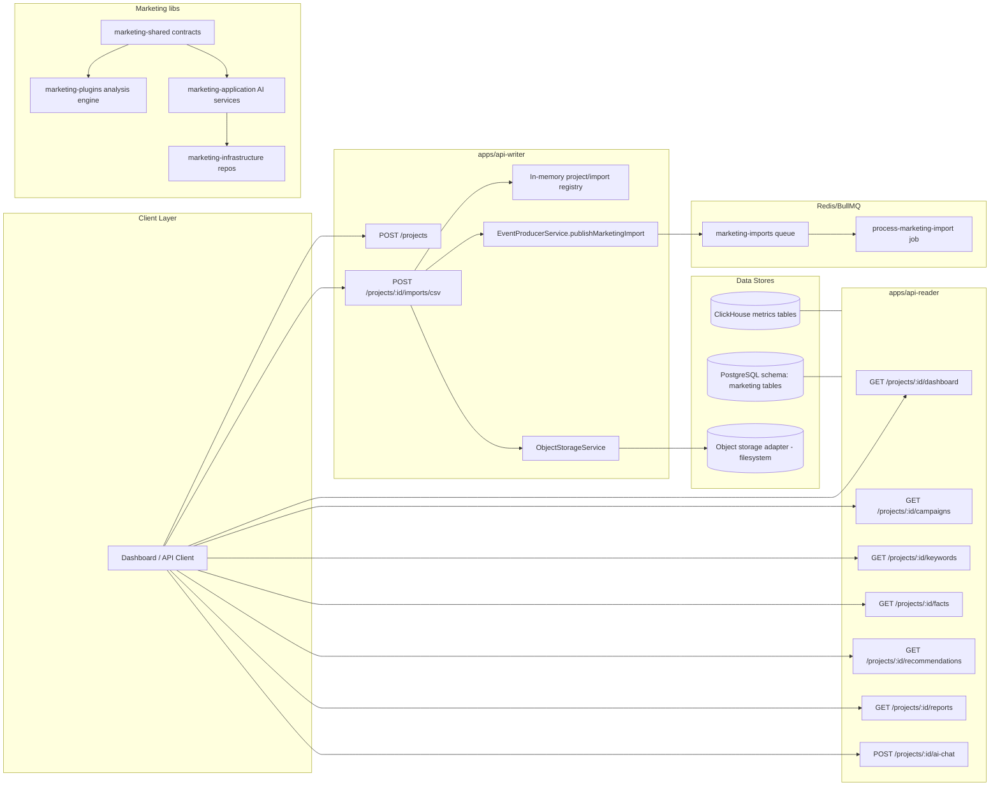
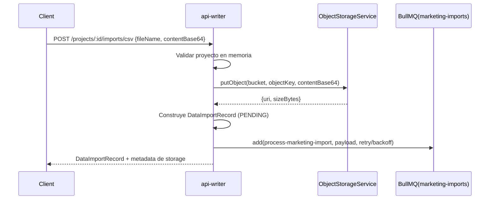
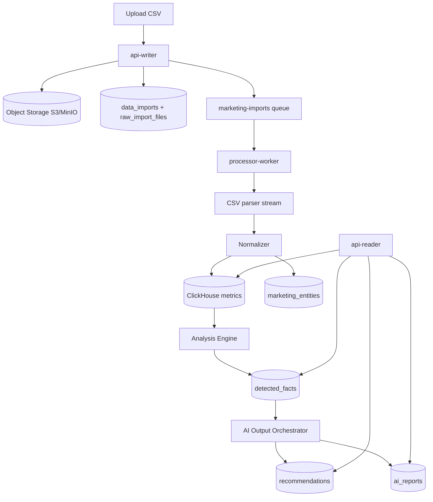

# AI Marketing Copilot V1 — Documento técnico de arquitectura y flujo actual

> Este documento resume **lo implementado** en el repositorio hasta ahora, el **flujo técnico actual** y los **siguientes puntos de integración** para completar el producto V1.

---

## 1. Objetivo técnico del sistema

Extender EventStream Platform con un feature-layer de Marketing Copilot para:

1. crear proyectos,
2. recibir imports CSV,
3. persistir payload de archivo en object storage,
4. encolar procesamiento asíncrono,
5. calcular/consultar métricas y hechos,
6. generar recomendaciones/reportes AI **facts-first**.

El sistema mantiene el core existente (`api-writer`, `api-reader`, `processor-worker`) y añade módulos de marketing sin reescritura del core.

---

## 2. Inventario de componentes implementados

## 2.1 Apps

- `apps/api-writer`
  - Endpoints de eventos + nuevos endpoints de proyectos/imports.
  - Publicación de jobs `process-marketing-import` en queue `marketing-imports`.
  - Escritura de payload CSV en adaptador de object storage local.

- `apps/api-reader`
  - Endpoints de lectura de métricas heredados.
  - Endpoints de lectura por proyecto: dashboard, campaigns, keywords, facts, recommendations, reports, ai-chat.

- `apps/processor-worker`
  - Base de worker existente.
  - Migraciones SQL añadidas (PostgreSQL + ClickHouse) para la capa marketing.

## 2.2 Librerías nuevas

- `libs/marketing-shared`
  - Enums y contratos de dominio (`FactType`, `Severity`, `DetectedFact`, etc.).

- `libs/marketing-plugins`
  - Analysis Engine determinístico + 8 reglas V1.

- `libs/marketing-application`
  - Capa AI defensiva (prompt, generadores, orquestación recommendations/reports).

- `libs/marketing-infrastructure`
  - Repositorios AI (in-memory actuales).
  - `ObjectStorageService` (adaptador local filesystem para stage de ingestión).

---

## 3. Diagrama de arquitectura implementada (estado actual)

---

## 4. Flujo técnico de import (actual)

### Propiedades relevantes del job

- queue: `marketing-imports`
- job name: `process-marketing-import`
- `attempts: 3`
- `backoff: exponential (2s)`
- `removeOnComplete: 1000`
- `removeOnFail: 5000`

---

## 5. Contratos de dominio (marketing-shared)

### Enums clave

- `EntityType`: campaign, adgroup, keyword, creative, account.
- `FactType`: 8 tipos V1 (HIGH_SPEND_ZERO_CONVERSIONS, LOW_CTR, etc.).
- `Severity`: INFO, WARNING, CRITICAL.
- `ImportStatus`: PENDING, PROCESSING, COMPLETED, FAILED.

### `DetectedFact`

Estructura base de hechos determinísticos:

- `entityId`, `entityType`
- `factType`, `severity`, `confidence`
- `temporalContext`
- `metricsSummary`
- `recommendationHint?`

Estos hechos son la interfaz entre análisis determinístico y capa AI.

---

## 6. Analysis Engine (marketing-plugins)

## 6.1 Diseño

- `AnalysisEngineService` orquesta plugins.
- `BaseAnalysisPlugin` normaliza ejecución por entidad y contrato de salida.
- `AnalysisMetricRow` define input tabular homogéneo para reglas.
- `AnalysisThresholds` y `DEFAULT_ANALYSIS_THRESHOLDS` parametrizan sensibilidad.

## 6.2 Reglas implementadas (V1)

1. HIGH_SPEND_ZERO_CONVERSIONS
2. LOW_CTR
3. HIGH_CPC
4. HIGH_CPA
5. LOW_ROAS
6. KEYWORD_WASTE
7. SCALING_OPPORTUNITY
8. DATA_QUALITY_WARNING

Cada regla genera `DetectedFact` determinístico y auditable.

---

## 7. Capa AI (marketing-application)

## 7.1 Guardrails

`AI_DEFENSIVE_SYSTEM_PROMPT` define restricciones:

- usar solo facts provistos,
- no inventar métricas/tendencias,
- declarar insuficiencia de datos,
- no analizar CSV crudo.

## 7.2 Servicios

- `AiExplainerService`: arma prompt controlado con facts.
- `RecommendationGeneratorService`: transforma facts en recomendaciones estructuradas.
- `ReportGeneratorService`: produce reporte markdown.
- `AiOutputOrchestratorService`: genera y persiste outputs AI.

---

## 8. Persistencia y esquemas

## 8.1 PostgreSQL (transaccional)

Migración `004_create_marketing_core_tables.sql` añade:

- `projects`
- `integrations`
- `data_imports`
- `raw_import_files`
- `marketing_entities`
- `entity_meta`
- `detected_facts`
- `recommendations`
- `ai_reports`
- `exchange_rates`
- `project_privacy_settings`

Con constraints e índices para filtros por proyecto, severidad, estado y tiempo.

## 8.2 ClickHouse (time-series)

Migración `001_create_marketing_metrics_tables.sql` añade:

- `marketing.marketing_daily_metrics`
- `marketing.marketing_metric_snapshots`

Con `ReplacingMergeTree`, partición mensual y skipping indexes.

---

## 9. API surface (estado actual)

## 9.1 Writer

- `POST /events` (existente)
- `POST /projects`
- `GET /projects`
- `POST /projects/:id/imports/csv`
- `GET /projects/:id/imports`

## 9.2 Reader

- `GET /metrics/:metricName`
- `GET /metrics`
- `GET /projects/:id/dashboard`
- `GET /projects/:id/campaigns`
- `GET /projects/:id/keywords`
- `GET /projects/:id/facts`
- `GET /projects/:id/recommendations`
- `GET /projects/:id/reports`
- `POST /projects/:id/ai-chat`

---

## 10. Estado de madurez por capa

- **API contract:** implementado a nivel scaffold funcional.
- **Queue orchestration:** implementado.
- **Storage write-before-queue:** implementado (adaptador local).
- **Deterministic analysis:** implementado.
- **AI defensiva:** implementada.
- **DB wiring real (TypeORM + repos reales):** pendiente en varios endpoints/servicios.
- **Worker end-to-end parse/normalize/clickhouse insert:** parcialmente scaffold; pendiente integración completa.

---

## 11. Gap técnico actual (para producción)

1. Reemplazar stores in-memory de `api-writer` y `api-reader` por repositorios persistentes.
2. Conectar `raw_import_files` y `data_imports` reales en PostgreSQL.
3. Implementar adapter S3/MinIO real en `ObjectStorageService`.
4. Implementar consumer del job `process-marketing-import` con:
   - parse CSV streaming,
   - normalización,
   - escritura a ClickHouse,
   - ejecución de Analysis Engine,
   - persistencia `detected_facts`.
5. Conectar `AiOutputOrchestratorService` a rutas reader/admin o jobs.
6. Añadir tests unitarios/e2e por módulo y flujo cross-service.

---

## 12. Diagrama de target de integración (siguiente iteración)

---

## 13. Referencias de código (archivos principales)

- Guía de arquitectura/agentes: `AGENTS.md`
- Writer API: `apps/api-writer/src/app/*`
- Reader API: `apps/api-reader/src/app/*`
- Queue producer: `libs/core-infrastructure/src/queues/*`
- Marketing shared contracts: `libs/marketing-shared/src/*`
- Analysis engine: `libs/marketing-plugins/src/analysis-engine/*`
- AI application layer: `libs/marketing-application/src/ai/*`
- AI repos + storage adapter: `libs/marketing-infrastructure/src/repositories/*`, `libs/marketing-infrastructure/src/storage/*`
- PostgreSQL migration: `apps/processor-worker/src/database/migrations/004_create_marketing_core_tables.sql`
- ClickHouse migration: `apps/processor-worker/src/database/migrations/clickhouse/001_create_marketing_metrics_tables.sql`

