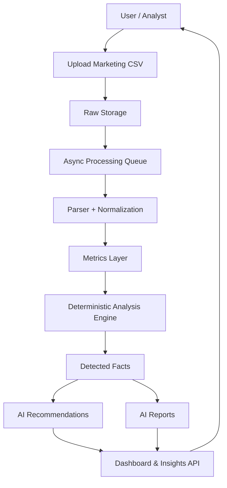

# AI Marketing Copilot — Project Overview

## Executive Summary
AI Marketing Copilot is a data-driven program designed to transform raw marketing performance data into actionable business decisions.

The platform ingests campaign-level data (initially CSV-based), processes it through deterministic analytics, detects prioritized issues/opportunities, and produces controlled AI recommendations and reports for growth teams.

This project is focused on **decision support**, not autonomous optimization.

---

## Project Objective
Build a reliable Marketing Intelligence layer that enables teams to:

1. consolidate campaign data,
2. evaluate KPI health consistently,
3. detect critical performance problems quickly,
4. receive explainable recommendations,
5. generate structured reports for recurring review cycles.

---

## Business Value
- Faster diagnosis of performance issues (spend waste, low efficiency, scaling signals).
- Standardized analysis criteria across teams and accounts.
- Reduced manual analyst effort for repetitive reporting.
- Better decision governance through facts-first AI outputs.

---

## Scope (V1)

### Included
- Project lifecycle management.
- CSV import workflow for marketing datasets.
- Raw file storage and async processing orchestration.
- Deterministic analysis engine with predefined rules.
- Structured fact generation (`detected facts`).
- AI recommendations generated from facts.
- AI report generation from facts.
- Reader APIs for dashboards, facts, recommendations, and reports.
- Controlled AI chat endpoint for project-level questions.

### Excluded (V1)
- Direct live integrations with ad network APIs.
- Fully autonomous optimization/bidding actions.
- Open Text-to-SQL access.
- Predictive modeling and reinforcement-learning loops.

---

## Functional Flow (High-Level)

---

## Analytical Model
The analytical core is deterministic and rule-based. It evaluates KPI signals such as:

- high spend with zero conversions,
- low CTR,
- high CPC,
- high CPA,
- low ROAS,
- keyword waste,
- scaling opportunities,
- data quality warnings.

Each detection produces a structured fact with severity, confidence, and evidence summary.

---

## AI Model Role (Guarded)
AI is used as an explanation and recommendation layer over validated facts.

### Core principles
- AI **does not** analyze raw source files directly.
- AI outputs are constrained to existing detected facts.
- AI must avoid inventing metrics/trends.
- AI must explicitly indicate insufficient data when applicable.

This design improves trustworthiness and auditability.

---

## Target Users
- Growth marketers
- Performance marketing managers
- Marketing analysts
- RevOps / GTM operations teams
- Agency account teams

---

## Expected Outcomes
- Shorter time from data upload to actionable insight.
- More consistent optimization decisions.
- Reproducible analysis framework across stakeholders.
- Executive-friendly reporting readiness with minimal manual effort.

---

## Program Status
The project currently has a complete V1 scaffold covering ingestion APIs, queue orchestration, core schemas, deterministic analysis modules, and AI orchestration services.

The next phase focuses on full production wiring (persistent repositories, worker runtime integration, and end-to-end test hardening).

---

## Success Criteria
A successful V1 allows a team to:
1. create a project,
2. upload marketing CSV data,
3. monitor import status,
4. view normalized KPI insights,
5. review detected facts,
6. consume AI recommendations,
7. generate an AI report,
8. query insights via controlled AI chat.
